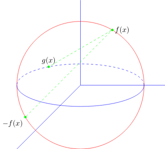

# Galería de ejemplos con Tikz

Para generar cada uno de los gráficos mostrados a continuación se ha empleado el archivo **main.tex** cuyo contenido es el sigueinte:

```tex
\documentclass[border=5pt]{standalone}
\usepackage{amsmath, amssymb}
\usepackage{tikz}
\usetikzlibrary{external}
\tikzexternalize[prefix=tikz/]
\usepackage{pgfplots}
\pgfplotsset{compat=1.17}
\newcommand{\inputtikz}[1]{
  \tikzsetnextfilename{#1}
  \input{tikz/#1.pgf}
}
\begin{document}
  \inputtikz{nombreArchivo}
\end{document}
```
El único camabio que debes realizar es reemplazar **nombreArchivo** por el que corresponde al código que se necesita compilar, recuerde que **nombreAarchivo.pgf** se encuentra dentro del directorio ***tikz/nombreArchivo.pgf***  y debido a que se hace uso de la librería ***external*** del paquete **TikZ**, se debe compilar haciendo uso de la siguiente instrucción:

```
pdflatex -synctex=1 -interaction=nonstopmode --shell-escape main.tex
```
Configura tu editor favorito para que este proceso sea más simple.
****

## Contenido
1. [Geometría](#geometria)
2. [Estadística](#estadistica)
3. [Cálculo](#calculo)

****
## 1. Geometría <a name = "geometria"></a>

* [arcosCirculos.pgf](https://github.com/richmon43/ejemplosTikz/blob/master/tikz/arcosCirculos.pdf)



```tex
\begin{tikzpicture}
  \draw[blue] (0, 0) -- (4, 0);
  \draw[blue] (0, 0) -- (-3, -3);
  \draw[blue] (0, 0) -- (0, 4);
  \draw[red] (0, 0) circle (3cm);
  \draw[blue] (-3, 0) arc(-180:0:3cm and 1cm);
  \draw[blue, dashed] (3, 0) arc (0:180: 3cm and 1cm);
  \node[fill = green, green, circle, draw, inner sep = 1pt] (A) at (210:3) {};
  \node[fill = green, green, circle, draw, inner sep = 1pt] (B) at (60:3) {};
  \node[fill = green, green, circle, draw, inner sep = 1pt] (C) at (120:3cm and 1cm) {};
  \draw[color = green, dashed] (A) node[below left, black] {$-f(x)$} -- %
    (B) node[right, black] {$f(x)$} -- (C) node[above, black] {$g(x)$};
\end{tikzpicture}
```
****

* [sectorCircular.pgf](https://github.com/richmon43/ejemplosTikz/blob/master/tikz/sectorCircular.pdf)


```tex
\begin{tikzpicture}[every node/.style={scale=.5, black}]
  \draw (0,0) circle (1.5);
  \draw (1.5,0) node[right]{$A(1.r)$} -- (0,0) -- node[pos=.5, left]{$D$} ++(60:1.5) node[right]{$B\left(\cos(x),\sin(x)\right)$} -- node[pos=0.5,xshift=6mm,yshift=3mm]{$x$} cycle;
  \draw (0.75,0) arc (0:60:0.75);
  \draw[densely dashed] (0,0) node[below left]{$O$} ++(60:1.5) -- (0.75,0) node[below]{$C$};
\end{tikzpicture}
```
****

## 2. Estadística <a name = "estadistica"></a>

* [graficoLineas.pgf](https://github.com/richmon43/ejemplosTikz/blob/master/tikz/graficoLineas.pdf)


```tex
\pgfplotstableread[col sep=comma]{tikz/graficoLineas.csv}\graficoLineas
\begin{tikzpicture}
  \begin{axis}[xlabel={Abril 2021}, ylabel={unidades}, grid=major, legend entries={$y=a$,$y=b$,$y=c$,$y=d$}, %
    legend style={font=\footnotesize, rounded corners=2pt, at={(0.3,0.95)}}]
    \addplot table [x=dia, y=a] {\graficoLineas};
    \addplot table [x=dia, y=b] {\graficoLineas};
    \addplot table [x=dia, y=c] {\graficoLineas};
    \addplot table [x=dia, y=d] {\graficoLineas};
  \end{axis}
\end{tikzpicture}
```
****

## 3. Cálculo <a name = "calculo"></a>

* [limiteLateral.pgf](https://github.com/richmon43/ejemplosTikz/blob/master/tikz/limiteLateral.pdf)


```tex
\begin{tikzpicture}[every node/.style={scale=.6,black}]
  \foreach \x in {1,2,...,5}{\draw (\x,.05) -- (\x,-.05) node[below]{$\x$};}
  \draw[-latex] (-0.5,0) -- (6,0) node[right]{$x$};
  \draw[-latex] (0,-0.5) -- (0,2) node[right]{$y$};
  \draw[domain=3:6, samples=250, thick] plot (\x,{sqrt(\x-3)});
  \node[rotate=20] at (4.5,1.4) {$f(x) = \sqrt{(x-3)}$};
\end{tikzpicture}
```
****

* [limiteInfinito.pgf](https://github.com/richmon43/ejemplosTikz/blob/master/tikz/limiteInfinito.pdf)


```tex
\begin{tikzpicture}[every node/.style={scale=.8, black}]
  \draw[-latex] (0,-0.5) -- (0,4) node[right]{$y$};
  \foreach \x in {-5,-4,...,-1,1,,2,...,5}{\draw (\x,0.05) -- (\x,-0.05) node[below]{$\x$};}
  \draw[-latex] (-6,0) -- (6,0) node[right]{$x$};
  \draw[densely dashed] (-6,3)--(6,3);
  \draw[domain=-6:6, samples=250, thick] plot (\x,{(3*(\x*\x))/((\x*\x)+3)});
  \node at (3.5,1.5) {$f(x) = \dfrac{3x^2}{x^2+3}$};
\end{tikzpicture}
```
****