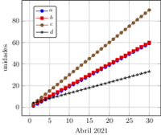

Esta es una colección de graficos usando el paquete Tikz, la galería oficial se puede encontrar en [TeXample.net](http://www.texample.net/tikz/examples/), pero hay varios aportes de usuarios que se han propuesto mostrarlos usando esta libreria que se ha vuelto muy popular entre la comunidad de LaTeX. ver [Galeria](./Galeria.md).

****

|  |  |
| ------------------------------------ | ------------------------------------ |
|  |  |
|  |  |

****

